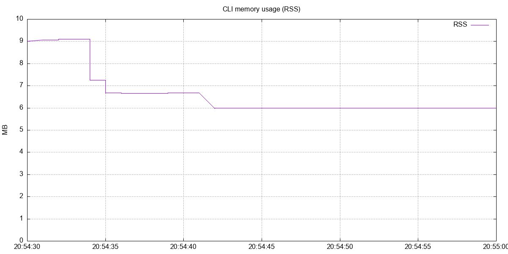
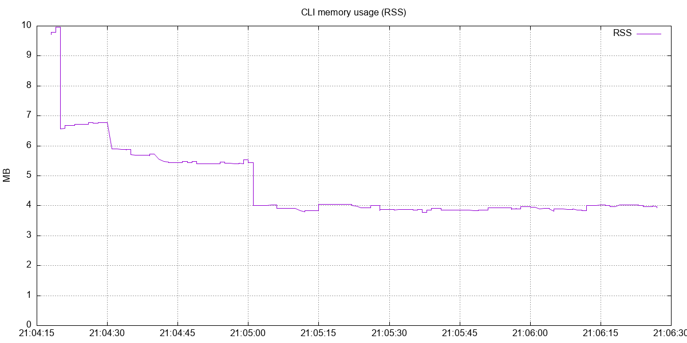
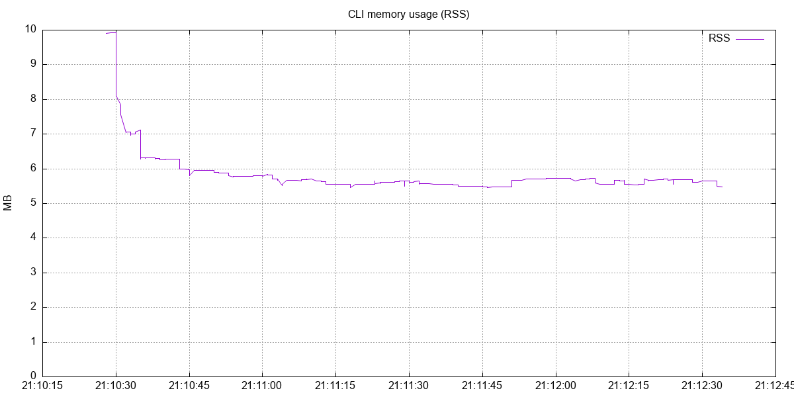
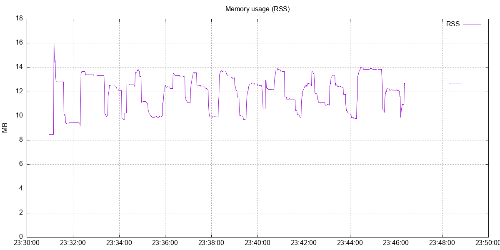

# fasthttp streaming HTTP client

A Go HTTP client library capable of streaming arbitrarily large files to an HTTP server via `POST multipart/form-data` without loading the file into RAM.

## How it works

The client opens the source file and creates an `io.Pipe`. A background goroutine reads the file in fixed-size chunks and writes them into a `multipart.Writer` connected to the pipe writer. The main goroutine feeds the pipe reader directly into `fasthttp`'s request body stream via `SetBodyStream(pr, -1)`.

Because the body size is unknown upfront, fasthttp uses chunked transfer encoding (`Transfer-Encoding: chunked`). Data flows from disk → chunk buffer → pipe → network socket without ever accumulating the full file in memory.

```
File on disk
    │
    │  Read in chunks (ChunkSize bytes)
    ▼
multipart.Writer  ──►  io.Pipe  ──►  fasthttp request body stream  ──►  network
```

At any point in time the process holds one chunk buffer of `ChunkSize` bytes (default 256 B) plus multipart framing overhead (~200 B). A 10 GB file uses the same memory as a 10 KB file.

## Key design decisions

- **`io.Pipe` as the bridge** — no intermediate buffer; the goroutine blocks on each `Write` until fasthttp reads the bytes off the pipe, providing natural backpressure
- **Configurable chunk size** — `chunkSize` in config; default is 256 bytes (intentionally small to demonstrate low RSS; increase for throughput)
- **fasthttp request/response pooling** — `AcquireRequest` / `AcquireResponse` avoid heap allocations per upload
- **Error propagation across goroutines** — write errors are sent back over a buffered channel and checked after `client.Do` returns, so neither side silently swallows failures

## Configuration

Config file path is set via `CONFIG_PATH` environment variable.

```yaml
cli:
  chunkSize: 256                      # read buffer size in bytes, default 256
  serverURL: http://localhost:8081/upload
```

## Run the CLI

```bash
CONFIG_PATH=config/config.local.yaml go run ./cmd/cli -- /path/to/file
```

## Memory monitoring

```bash
# terminal 1 — start monitoring before launching the CLI
./rec-memory-cli.sh

# terminal 2 — run the upload
CONFIG_PATH=config/config.local.yaml go run ./cmd/cli -- ./data.bin

# after CLI exits, build the graph
./rec-graph-cli.sh
# output: cli-mem.png
```

`rec-memory-cli.sh` waits for `cli.pid` to appear, polls RSS once per second, and stops automatically when the CLI process exits.

### Memory usage

RSS during CLI upload of a 10 GB file with `chunkSize=256` stays flat throughout the entire run.



RSS during CLI upload of a 10 GB file with `chunkSize=1KB` stays flat throughout the entire run.



RSS during CLI upload of a 10 GB file with `chunkSize=10MB` stays flat throughout the entire run.



---

## Additionally: fasthttp receiving server

HTTP server for receiving large file uploads via `POST multipart/form-data` without loading the file into RAM. Provided as a minimal test target for the client above.

### How it works

`fasthttp` is configured with `StreamRequestBody: true` and `DisablePreParseMultipartForm: true`, which prevents the framework from buffering the request body. The body is read as a stream directly from the network socket.

A fixed-size read buffer (64 KB) is reused across requests via `sync.Pool`. At any point in time, only one buffer per active connection is allocated — regardless of file size.

### Configuration

```yaml
settings:
  level: info
  idleTimeout: 30s
  writeTimeout: 120s
  concurrency: 200
  maxBodySize: 107374182400  # 100 GB
```

### Run locally

```bash
# terminal 1 — receiving server (port 8081)
go run ./cmd/chunk-server

# terminal 2 — original streaming server (port 8080)
CONFIG_PATH=config/config.local.yaml go run ./cmd/fasthttp
```

### Test with curl

Generate a test file and upload it directly to the server:

```bash
dd if=/dev/urandom of=data.bin bs=1M count=100

curl -X POST -F "file=@./data.bin" http://localhost:8081/upload
```

### Memory usage

RSS during load test with 500 total uploads (40 concurrent) of a 10 GB file stays between 9–16 MB.


